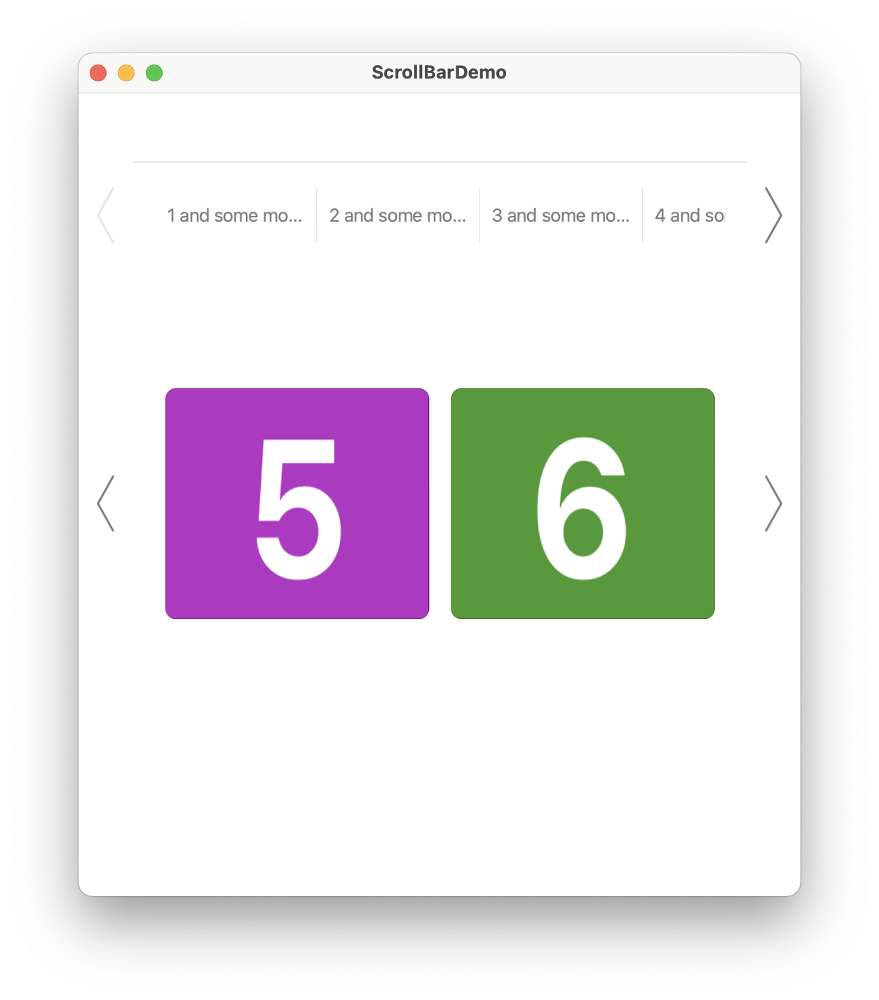
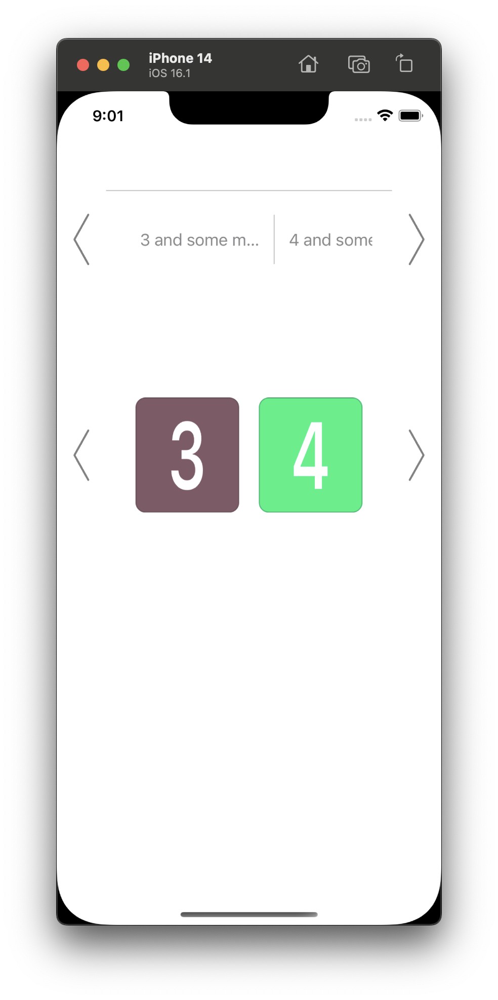

# ScrollBar

A Mac Appstore like scroller component written with UIKit. Feel free to fork the project and adapt it to your needs. There are still a couple of rough edges in the project. All relevant source files can be found in the `ScrollbarView` subfolder. A simple example can be found in the `ViewController.swift` file.

Pull requests are always welcome ! 

### Screenshots

##### Mac


##### iOS



### Example

##### Textscroller
Horizontal aligned text components, separated with a thin line, with a fixed width of 150 for each component. The left and right arrows are always displayed. The snapping size is set to zero, which means the scrollview scrolls continuously. 

```Swift
let textScroller = ScrollbarView(frame: CGRect(x: 0, y: 100, width: 0, height: 100))
textScroller.register(itemClass: ScrollbarViewTextItem.self, forItemWithReuseIdentifier: "Cell")
textScroller.dataSource = self
textScroller.delegate = self
textScroller.showsArrows = true
textScroller.showsSeparators = true
textScroller.autohideArrows = false
textScroller.itemSizingBehaviour = .fixed(150)
textScroller.snappingStepSize = 0
```

##### Image Scroller

Horizontal aligned images. Each item occupies enough space to fit two images inside the scrollview frame. The arrows are only shown on mouse hover. The snapping size is set to two, which means paging with two items per page is enabled.

```Swift
let imageScroller = ScrollbarView(frame: .zero)
imageScroller.register(itemClass: ScrollbarViewImageItem.self, forItemWithReuseIdentifier: "ImageCell")
imageScroller.dataSource = self
imageScroller.delegate = self
imageScroller.showsArrows = true
imageScroller.showsSeparators = false
imageScroller.autohideArrows = false
imageScroller.itemSizingBehaviour = .dynamic(2)
imageScroller.snappingStepSize = 2
imageScroller.isScrollEnabled = true
```

##### Custom 

You can create your own content by creating a subclass of `ScrollbarViewItem`. Take a look at `ScrollbarViewImageItem` and `ScrollbarViewTextItem` for an example of how the subclass should look like. 

##### ScrollbarViewDataSource

You should implement these methods to define the items that should be displayed.

```Swift
func numberOfItems(in scrollbarView: ScrollbarView) -> Int {
    return 7
}

func scrollbarView(_ scrollbarView: ScrollbarView, itemAtIndex index: Int) -> ScrollbarViewItem {
	// imageScroller
    if scrollbarView == imageScroller {
        let item = scrollbarView.dequeueReusableItem(withReuseIdentifier: "ImageCell", for: index) as? ScrollbarViewImageItem
        let itemSize = scrollbarView.calculateItemSize(inFrame: self.view.bounds)
        item?.image = UIImage(text: "\(index + 1)", color: .random(), size: itemSize)
        return item!
    }

	// textScrolller
    let item = scrollbarView.dequeueReusableItem(withReuseIdentifier: "Cell", for: index) as? ScrollbarViewTextItem
    item?.backgroundColor = .clear
    item?.titleLabel.text = "\(index + 1) and some more text and more and more and even more and even even more !!!"

    return item!
}
```


##### ScrollbarViewDelegate

You can use the delegate to responds to click events.

```Swift
func scrollbarView(_ scrollbarView: ScrollbarView, didSelectItemAtIndex index: Int) {
    print("Did select item: \(index)")
}
```